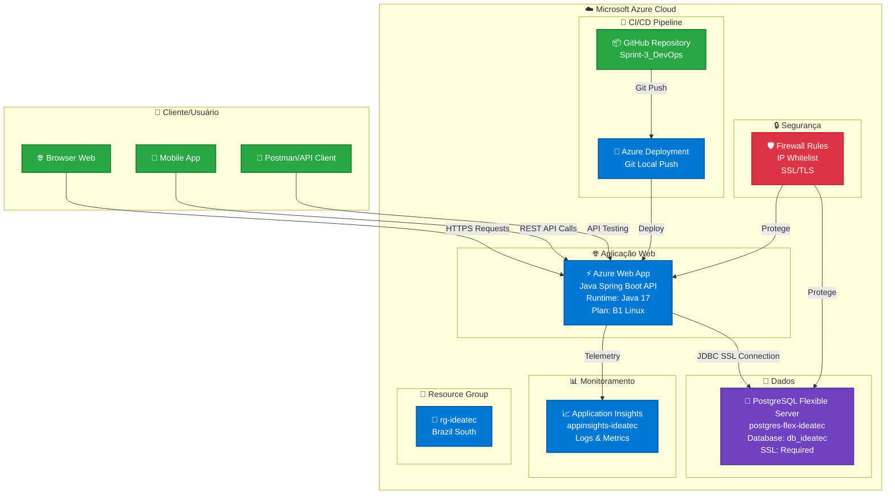
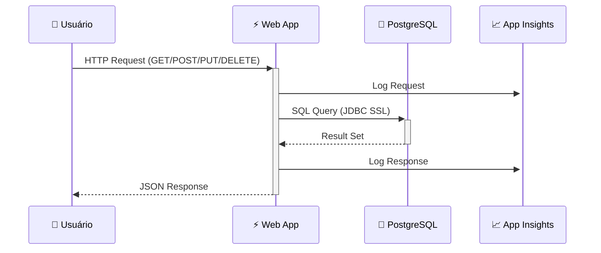
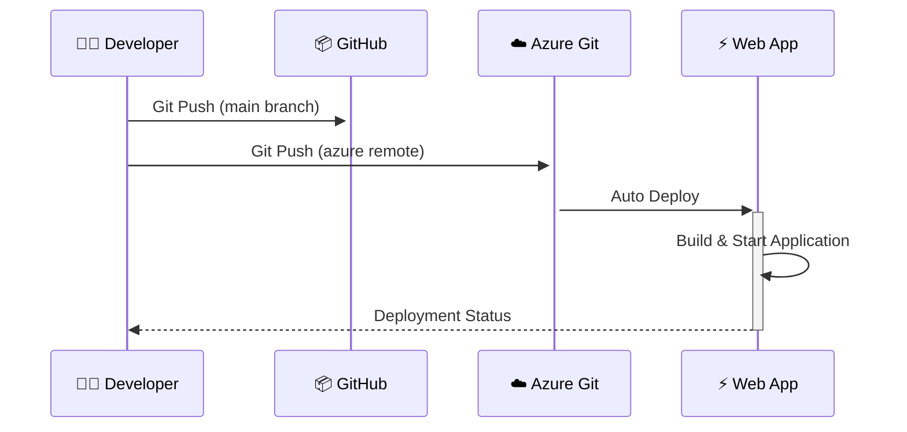

# 🏗️ Arquitetura da Solução IdeaTec - DevOps & Cloud Computing

## 📊 Diagrama de Arquitetura



## 🔄 Fluxo Detalhado de Operações

### 1. 📥 Fluxo de Requisição (Request Flow)


### 2. 🚀 Fluxo de Deploy (Deployment Flow)


## 🏗️ Componentes da Arquitetura

### 🎯 **Camada de Apresentação**
- **Browser Web**: Interface principal para usuários finais
- **Mobile Apps**: Aplicações móveis consumindo a API
- **API Clients**: Ferramentas de teste e integração (Postman, Insomnia)

### ⚡ **Camada de Aplicação**
- **Azure Web App**: Hospedagem da aplicação Spring Boot
  - Runtime: Java 17
  - Framework: Spring Boot 3.x
  - Arquitetura: RESTful API
  - SSL/TLS: Habilitado
  - Escalabilidade: Plan B1 (Burstable)

### 💾 **Camada de Dados**
- **PostgreSQL Flexible Server**: Banco de dados principal
  - Versão: PostgreSQL 13
  - Tier: Burstable (Standard_B1ms)
  - Storage: 32GB
  - SSL: Obrigatório
  - Backup: Automático

### 📊 **Camada de Monitoramento**
- **Application Insights**: Telemetria e observabilidade
  - Logs de aplicação
  - Métricas de performance
  - Rastreamento distribuído
  - Alertas personalizados

### 🔒 **Camada de Segurança**
- **Firewall Rules**: Controle de acesso por IP
- **SSL/TLS**: Criptografia em trânsito
- **Environment Variables**: Secrets management
- **RBAC**: Controle de acesso baseado em roles

## 🔧 Tecnologias Utilizadas

| Categoria | Tecnologia | Versão | Propósito |
|-----------|------------|---------|-----------|
| **Backend** | Java | 17 LTS | Linguagem principal |
| **Framework** | Spring Boot | 3.x | Framework web |
| **Database** | PostgreSQL | 13 | Banco de dados |
| **Cloud** | Microsoft Azure | Latest | Plataforma cloud |
| **Monitoring** | Application Insights | Latest | Observabilidade |
| **Build** | Maven | 3.x | Gerenciamento de dependências |
| **VCS** | Git | Latest | Controle de versão |

## 📈 Métricas e KPIs

### 🎯 **Performance**
- Response Time: < 200ms (média)
- Throughput: 1000+ req/min
- Availability: 99.9% uptime
- Error Rate: < 1%

### 🔍 **Monitoramento**
- CPU Usage: < 70%
- Memory Usage: < 80%
- Database Connections: Monitorado
- SSL Certificate: Válido

### 🚀 **DevOps**
- Deploy Time: < 5 minutos
- Rollback Time: < 2 minutos
- Code Coverage: > 80%
- Security Scans: Automático

## 🛠️ Comandos de Gestão

### 📦 **Deploy**
```bash
# Configurar remote Azure
git remote add azure https://user@webapp-ideatec.scm.azurewebsites.net/webapp-ideatec.git

# Deploy para produção
git push azure main
```

### 🔍 **Monitoramento**
```bash
# Verificar logs da aplicação
az webapp log tail --name webapp-ideatec --resource-group rg-ideatec

# Status dos recursos
az resource list --resource-group rg-ideatec --output table
```

### 💾 **Banco de Dados**
```bash
# Conectar ao banco
psql "host=postgres-flex-ideatec.postgres.database.azure.com port=5432 dbname=db_ideatec user=admin_ideatec sslmode=require"

# Backup
pg_dump -h postgres-flex-ideatec.postgres.database.azure.com -U admin_ideatec -d db_ideatec > backup.sql
```

## 🎯 Benefícios da Arquitetura

### ☁️ **Cloud-Native**
- ✅ Escalabilidade automática
- ✅ Alta disponibilidade
- ✅ Disaster recovery
- ✅ Pay-as-you-use

### 🔄 **DevOps**
- ✅ CI/CD automatizado
- ✅ Infrastructure as Code
- ✅ Monitoring contínuo
- ✅ Deploy rápido e seguro

### 🔒 **Segurança**
- ✅ SSL/TLS end-to-end
- ✅ Firewall configurado
- ✅ Secrets management
- ✅ Compliance Azure

### 📊 **Observabilidade**
- ✅ Logs centralizados
- ✅ Métricas em tempo real
- ✅ Alertas proativos
- ✅ Performance insights

---

> 🎓 **Projeto desenvolvido para:** FIAP - Faculdade de Informática e Administração Paulista  
> 📚 **Disciplina:** DevOps Tools e Cloud Computing  
> 👨‍💻 **Desenvolvido por:** Pedro Ladeira  
> 📅 **Data:** Outubro 2025